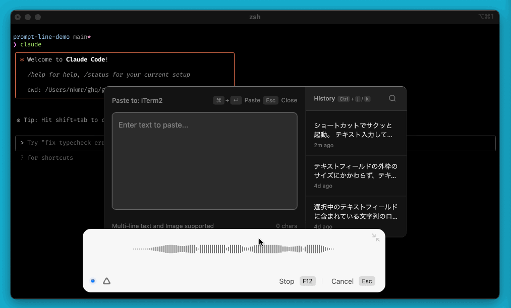
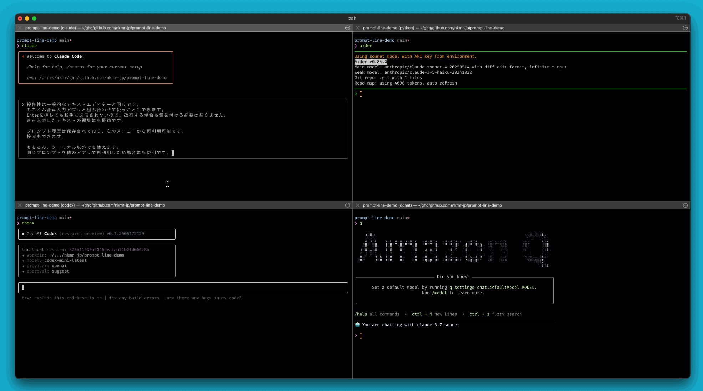

[English](README.md) | [日本語](README_ja.md)

# 🧑‍💻 Prompt Line

macOS floating text input tool that enables quick text entry across any application.

## Overview

Prompt Line is a macOS app developed to improve the prompt input experience in the terminal for CLI-based AI coding agents such as [Claude Code](https://github.com/anthropics/claude-code), [OpenAI Codex CLI](https://github.com/openai/codex), and [Aider](https://github.com/paul-gauthier/aider).
It addresses UX challenges related to multi-byte character input (e.g., Japanese) by providing a dedicated floating input interface. 

This greatly reduces stress when entering text in the following cases in particular. 

1. **Prompt input for CLI-based AI coding agents in the terminal** 
2. **Chat apps where pressing Enter sends the message at an unintended time** 
3. **Text editor with slow input response (e.g., large Confluence documents)**


## Features

### Quick Launch, Quick Paste
Quick launch with shortcut (`Cmd+Shift+Space`).<br>
Type text and quick paste (`Cmd+Enter`).


### Perfect for Editing Voice-Inputted Text
The operation is the same as a typical text editor. <br>
Of course, you can also use it in combination with a voice input app. <br>
Pressing Enter will not automatically send the text, so you don't have to worry about line breaks. <br>
It is also ideal for editing text entered by voice. <br>
(This video uses [superwhisper](https://superwhisper.com/).)


### Search and Reuse Prompt History
Prompt history is saved and can be reused from the right menu. <br>
Search is also available. (`Cmd+f`)


### Launch Anywhere
Can be launched anywhere there's a text input field. <br>
Also convenient when you want to reuse the same prompt in other apps.

Of course, it works outside of terminal too.


## 📦 Installation

### System Requirements

- macOS 10.14 or later
- Node.js 20 or later
- Xcode Command Line Tools or Xcode (for compiling native tools)

### Build from Source

1. Clone the repository:
   ```bash
   git clone https://github.com/nkmr-jp/prompt-line.git
   cd prompt-line
   ```

   To build a specific version:
   ```bash
   git clone https://github.com/nkmr-jp/prompt-line.git
   cd prompt-line
   git checkout v0.4.1  # Replace with desired version tag
   ```

2. Install dependencies:
   ```bash
   npm install
   ```

3. Build the application:
   ```bash
   npm run build
   ```

4. The built app will be created in the `dist/` directory
5. Open the dmg file:
   ```bash
   open dist/Prompt-Line-0.4.1-arm64.dmg # Apple Silicon
   open dist/Prompt-Line-0.4.1-x64.dmg # Intel
   ```
6. Drag Prompt Line.app to Applications folder
7. Launch Prompt Line. An icon will appear in the system tray.
<div></div>
8. You can start using it with `Cmd+Shift+Space`.

### Accessibility Permissions

Prompt Line requires accessibility permissions to paste text into other applications.
A dialog box will appear on first use, so follow the instructions to set it up.

<div></div>


## Troubleshooting

### If the accessibility permissions dialog box does not appear

1. Open **System Settings** → **Privacy and Security** → **Accessibility**.
2. Find “Prompt Line” in the list and enable it.
3. If it is not in the list, add Prompt Line from Applications using the “+” button.

### If “Prompt Line” is enabled in Accessibility Permissions but you still cannot paste

1. Open **System Settings** → **Privacy and Security** → **Accessibility**
2. Delete “Prompt Line” from Applications using the “-” button to reset permissions
3. The issue should be resolved after reconfiguring settings.

Accessibility permissions can also be reset using the following command:
```bash
npm run reset-accessibility
```

## Usage

### Basic Workflow
1. Move to where you want to input
2. Press `Cmd+Shift+Space` to open Prompt Line
3. Type your text
4. Press `Cmd+Enter` to paste text
5. Continue working

### Features

- **History Panel** - Click previous entries to reuse. Search is also available.
- **Draft Autosave** - Automatically saves your work
- **Image Support** - Paste clipboard images with `Cmd+V`

## ⚙️ Settings

You can customize Prompt Line's behavior by creating a settings file at `~/.prompt-line/settings.yaml`:

```yaml
# Prompt Line Settings Configuration
# This file is automatically generated but can be manually edited

# Keyboard shortcuts configuration
shortcuts:
  # Global shortcut to show/hide the input window
  # Format: Modifier+Key (e.g., Cmd+Shift+Space, Ctrl+Alt+Space)
  # Available modifiers: Cmd, Ctrl, Alt, Shift
  main: Cmd+Shift+Space

  # Shortcut to paste selected text and close window
  # Used when typing in the input window
  paste: Cmd+Enter

  # Shortcut to close window without pasting
  # Used to cancel input and close window
  close: Escape

  # Shortcut to navigate to next history item
  # Used when browsing paste history
  historyNext: Ctrl+j

  # Shortcut to navigate to previous history item
  # Used when browsing paste history
  historyPrev: Ctrl+k

  # Shortcut to enable search mode in history
  # Used to filter paste history items
  search: Cmd+f

# Window appearance and positioning configuration
window:
  # Window positioning mode
  # Options:
  #   - 'active-text-field': Position near the currently focused text field (default, falls back to active-window-center)
  #   - 'active-window-center': Center within the currently active window
  #   - 'cursor': Position at mouse cursor location
  #   - 'center': Center on primary display
  position: active-text-field

  # Window width in pixels
  # Recommended range: 400-800 pixels
  width: 600

  # Window height in pixels
  # Recommended range: 200-400 pixels
  height: 300

```


## Prompt History

- All data stored locally on your Mac
- No internet connection required
- Prompt history saved in `~/.prompt-line/history.jsonl`
- Saved in JSON Lines format, so you can analyze it using [DuckDB](https://duckdb.org/)


## 📄 License

MIT License - see [LICENSE](./LICENSE) for details.